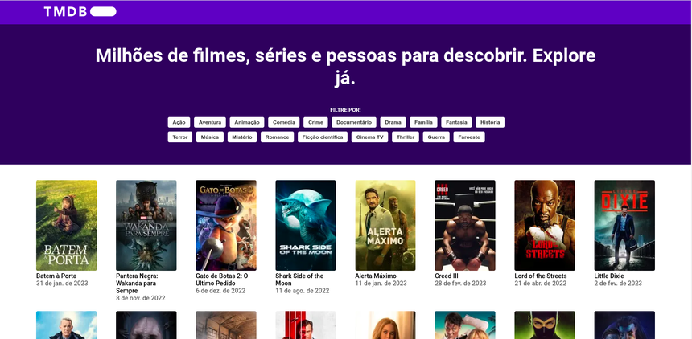

# The Movie Bit

This project was developed as part of the hiring process of the Promobit company. [Instructions here (pt-BR)](https://github.com/Promobit/front-end-challenge)

## Screenshot



## Avaliable scripts

### Run and start developement server

```
npm install
npm run start
```

or

```
yarn
yarn start
```

## Technologies

- [Next.js](https://nextjs.org/)
- [React.js](https://www.typescriptlang.org/)
- [Styled Components](https://styled-components.com/)
